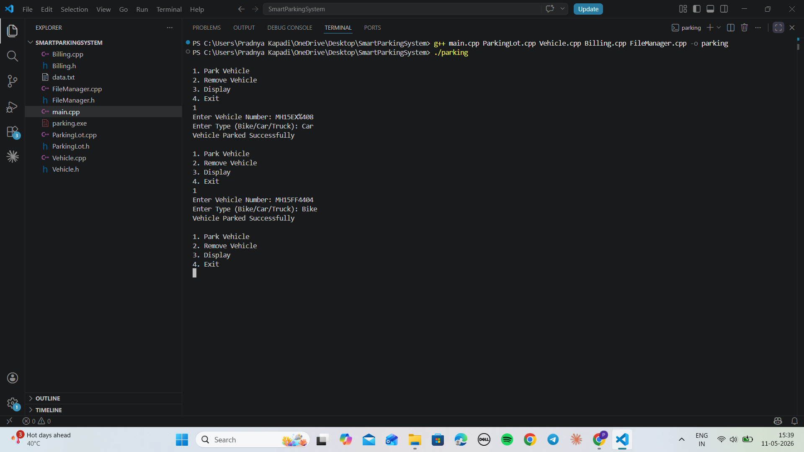

# smart-parking-management-system-cpp
Advanced C++ Smart Parking Management System with OOP, STL, and File Handling
A modular C++ application to automate parking operations using OOP concepts.

## Features
- Vehicle Entry / Exit
- Time-based Billing
- Slot Management
- File Handling
- STL Based Data Storage

## Technologies
C++, OOP, STL, File Handling

## How to Run
g++ main.cpp ParkingLot.cpp Vehicle.cpp Billing.cpp Vehicle.cpp -o parking
./parking

## Screenshots

## Author
Parth Kapadi
